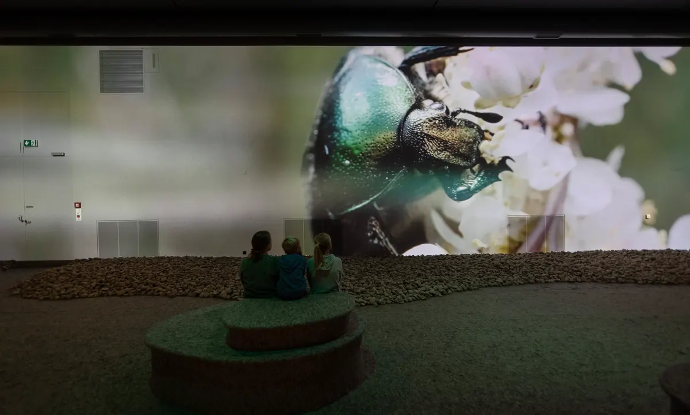

+++
title = "Alles wird gut, auch bei den Insekten"
date = "2024-02-20"
draft = false
pinned = false
image = "insektensterben-titel.jpg"
+++
<!--StartFragment-->



Die Situation der Insekten in der Schweiz ist beängstigend. In den letzten drei Jahrzehnten hat der Mensch in verschiedenen Gebieten die Insektenpopulation um 75% reduziert.  Forscher:innen weisen schon lange auf den rapiden Rückgang vieler verschiedener Insektenarten hin. Sowohl dem Aussterben als auch den damit verbundenen Umweltschäden wird keine grosse Aufmerksamkeit geschenkt. Das Naturhistorische Museum Bern greift das brisante Thema auf und entwirft eine Sonderausstellung dazu. "Alles wird gut", so der Titel. Die Ausstellung ist optimistisch. Haben wir auch einen Grund dazu?



Robert, Steven und Moritz

<!--EndFragment-->

<!--StartFragment-->

Caruso, steht nicht schlecht auf dem Dach und das jetzt schon seit Herbst 2014. Der goldene Elefant auf dem hohen Dach des Museums wurde zu einer Art Markenzeichen. Und er fällt auch uns immer noch auf, wenn wir zum hundertsten Mal das Museum betreten. An der Fassade hängt ein riesiges griesgraues Plakat, das eine zersplitterte Glasscheibe zeigt. “Insektensterben - Alles wird gut.” ist mit fetten gelben Buchstaben darauf geschrieben. 

Im obersten Stockwerk sitzt Simon Jäggi auf dem schwarzen Ledersofa des Pausenraums. Er trägt ein schwarzes Stoffhemd, seine Haare sind zu einem Vokuhila geschnitten, seine Regenbogen gestreiften Socken trägt er über die blauen Cargo Jeans. Er wirkt jung aber trotzdem sehr erfahren, vielleicht ist es die Art, wie er dort im tief schwarzen Ledersofa sitzt und eine Mail verfasst. Oder ist es doch der scharfe Blick, der ein wenig Angst auslöst. Der Raum ist gross und nimmt einem aus der Museums-Atmosphäre raus, es gibt eine kleine Küche, den grossen Esstisch und dieses schwarze Ledersofa. 

**Kleine Tierchen, grosse Wirkung**

Man ist erschüttert und es macht einen traurig, wenn man sich von den Zahlen, Fakten und Statistiken rund um das Aussterben der kleinen Tierchen um uns berieseln lässt. Die eine oder andere von euch macht es vielleicht wütend, dass wir so weitermachen wie immer und wahrscheinlich darauf warten, bis es zu spät ist. Bis wir wirklich alle fossilen Rohstoffe aufgebraucht haben und damit die Luft, Bäume, Böden, uns selbst und vor allem die Tierwelt zerstört haben. Doch vielen von euch geht es wahrscheinlich wie dem Grossteil der Menschheit, es ist uns noch egal. Handeln tun wir erst, wenn auch der Nachbar nebenan mit dem Velo in die Stadt fährt und nicht mehr mit dem SUV. Oder die Züge billiger werden als die Flüge. Wenn es Pfandflaschen auch in der Schweiz gibt, dann handeln wir vielleicht. 

Und aus diesem Grundgedanken entstand die Ausstellung mit einem so provokanten Titel. “Es ist der Versuch, eine nicht deprimierende Ausstellung zu einem sehr deprimierenden Thema zu machen.” wo andere vielleicht ihre Waffen niederlegen, fängt Simon Jäggi erst an. 

<!--EndFragment-->